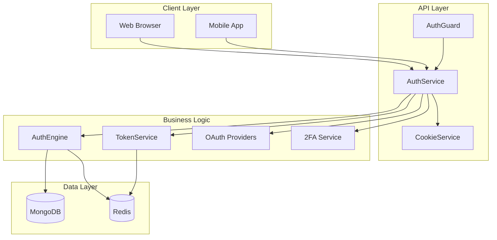
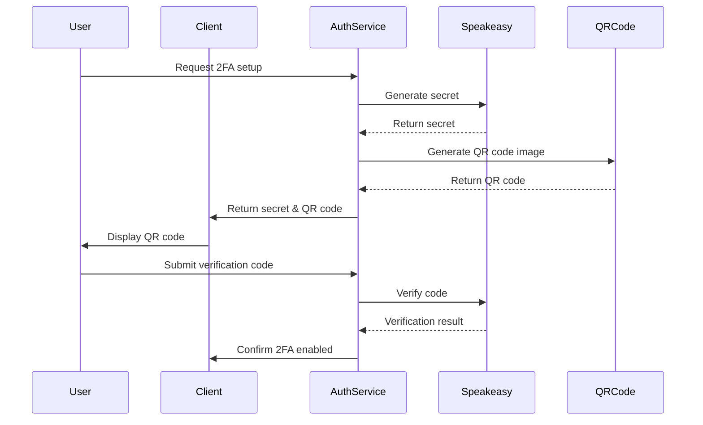

# 2FA



# Auth Module

This module provides a robust authentication and session management system for Node.js applications built with Express and Mongoose. It supports password-based authentication, session tokens, multi-provider OAuth (Google, GitHub, Twitter, Facebook, Discord), two-factor authentication (2FA), password/email updates, and device/session tracking.

## Features

- **User Signup & Verification:** Register users and send OTPs for email verification.
- **Sign-In & Sessions:** Authenticate users via password, manage secure sessions with JWT tokens and cookies.
- **OAuth Providers:** Login via Google, GitHub, Twitter, Facebook, Discord (with profile extraction and session creation).
- **Two-Factor Authentication (2FA):** Enable, confirm, and verify 2FA with QR code and TOTP support (via Google Authenticator).
- **Password & Email Management:** Forgot password flow, password reset, update password/email with verification.
- **Session Management:** Track, list, and revoke sessions (single, all, or other devices).
- **Security:** Device and browser signatures, session token rotation, forbidden field sanitization, timing-safe comparisons, encrypted payloads.
- **Redis & MongoDB:** Session data is stored and synchronized across Redis and MongoDB for scalability and reliability.

## File Structure

- `AuthService`: Main authentication controller, extends `AuthEngine`. Handles all auth routes, logic, and flows.
- `AuthEngine`: Core engine for session, OTP, email normalization, and session store/rotation/removal.
- `TokenService`: Handles token creation, rotation, signature validation, and security checks.
- `CookieService`: Cookie management for different user roles (seller/buyer), options, clearing, and expiration logic.
- Guard/Models/Utils: Integrates with your app's user model, security utilities, configuration, and error handling.

## Usage

### Initialization

```js
import { sellerModel, UserRole } from '@server/models';
import { AuthService } from '../services/auth/AuthService';
import { AuthGuard } from '@server/guard';

const payload = {
  model: sellerModel,
  role: 'seller',
};

const authControllerHub = new AuthService(payload);
const authGuard = new AuthGuard(payload);

export { authControllerHub, authGuard };
```

### Typical Auth Flows

- **Signup:** `authControllerHub.signup(req, res, next)`
- **Verify Email:** `authControllerHub.verifyEmail(req, res, next)`
- **Sign-In:** `authControllerHub.signin(req, res, next)`
- **OAuth:** `authControllerHub.googleAuth(req, res, next)` (and other providers)
- **2FA Setup:** `authControllerHub.generate2FASetup(req, res, next)`
- **2FA Confirm:** `authControllerHub.confirm2FASetup(req, res, next)`
- **Password Reset:** `authControllerHub.forgotPasswordRequest(url)(req, res, next)`, `authControllerHub.resetPasswordRequest(req, res, next)`
- **Email Update:** `authControllerHub.updateEmailRequest(url)(req, res, next)`, `authControllerHub.updateEmail(req, res, next)`
- **Session Management:** `authControllerHub.signout(req, res)`, `authControllerHub.signoutSession(req, res)`, `authControllerHub.getSessions(req, res, next)`

## Security Highlights

- Cookie separation by role (seller vs buyer).
- All session tokens signed and rotated with device/browser metadata.
- Redis and MongoDB keep session states in sync for fast invalidation.
- OTP and 2FA payloads are encrypted before transmission.
- All sensitive fields (password, email) are sanitized from queries.
- Timing-safe equality checks prevent timing attacks.
- All errors are handled with meaningful HTTP status codes and user-friendly messages.

## Extending

- **Add more OAuth providers:** Implement a new method similar to existing provider methods, using `this.oauth()`.
- **Support more session stores:** Extend `storeSession`, `rotateSession`, and related methods.
- **Customize cookie settings:** Adjust `CookieService` options, expiration, and domain logic.
- **Connect to front-end:** Use API routes to connect with React/Vue/Angular login/signup flows.

## Dependencies

- Express
- Mongoose
- jsonwebtoken
- speakeasy (for TOTP 2FA)
- qrcode (for QR code generation)
- Redis (for fast session cache)
- User agent parser (for device info)
- Passport.js (for social login)

## Example API Endpoints

- `POST /api/auth/signup`
- `POST /api/auth/verify-email`
- `POST /api/auth/signin`
- `GET /api/auth/oauth/:provider`
- `POST /api/auth/2fa/setup`
- `POST /api/auth/2fa/confirm`
- `POST /api/auth/forgot-password`
- `POST /api/auth/reset-password/:token`
- `POST /api/auth/update-password`
- `POST /api/auth/update-email-request`
- `POST /api/auth/update-email`
- `GET /api/auth/sessions`
- `POST /api/auth/signout`
- `POST /api/auth/signout-session/:token`
- `POST /api/auth/signout-all`

## Customization

- Adjust forbidden/sanitized fields in `sanitizeFields`.
- Change cookie domain and settings in `COOKIE_OPTIONS_HTTP` and `COOKIE_OPTIONS_NOT_HTTP`.
- Use your own email sending logic in `SendEmail`.
- Integrate with your user model and roles.

## License

MIT

## Contributing

Feel free to open issues or pull requests for improvements, bug fixes, or new features!
